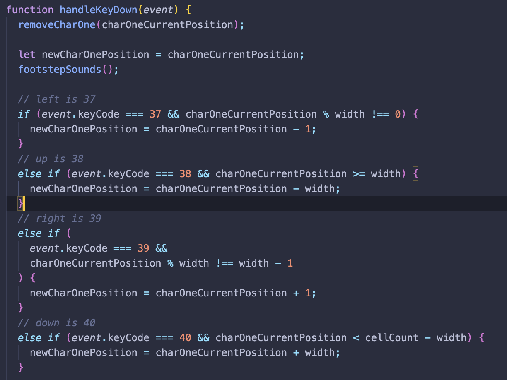
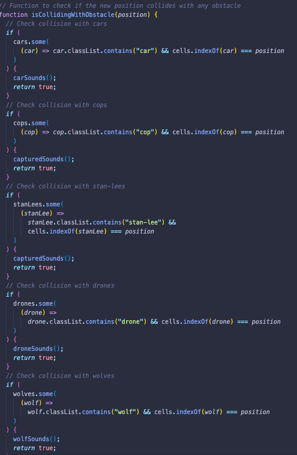
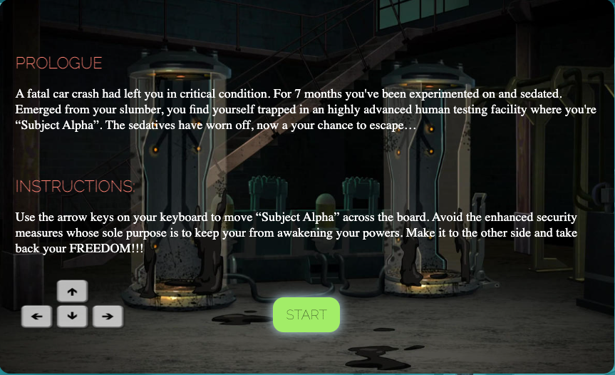
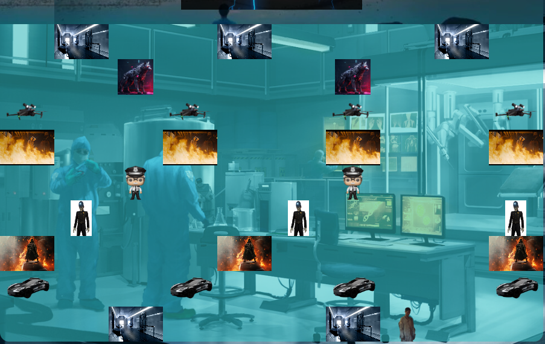
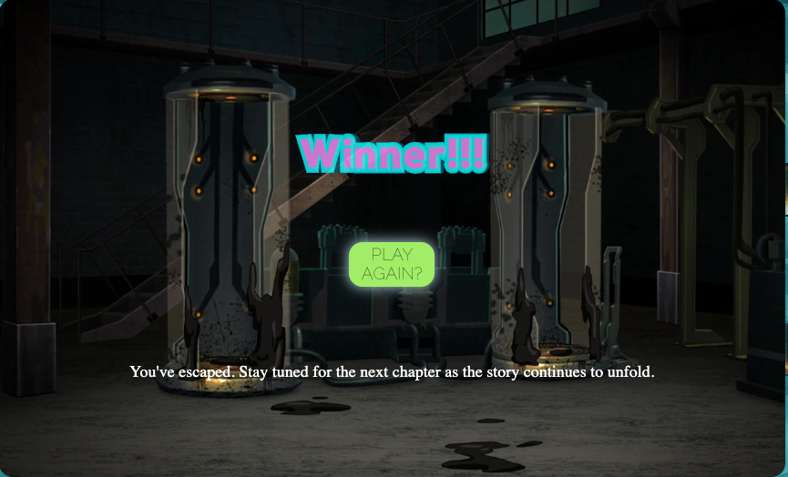
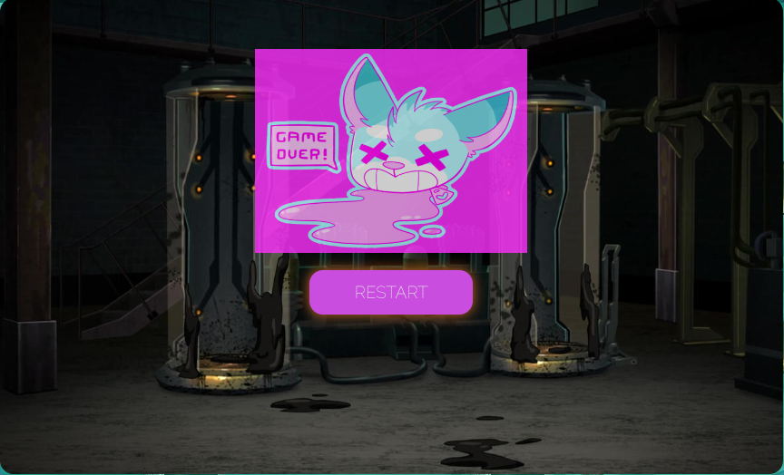
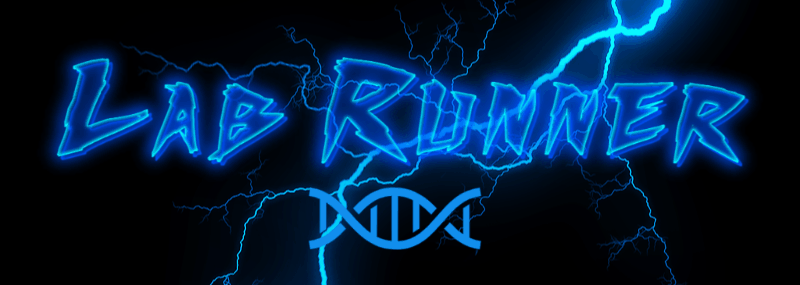

# General Assembly

Lab Runner is a game that I created which was inspired by the popular game Frogger. The object of the game is to help the human test subject "Subject Alpha" escape the lab and make his way to freedom. To win, you have to cross the board while avoiding the various obstacles in the process.

## Link to Game

[Lab Runner](https://joshua-bake.github.io/Lab-Runner/)

## Overview

I was responsible for developing a grid-based game using JavaScript, HTML and CSS and had a week to complete it. This is my take on the Frogger game, where the character has to cross the board and make it to the over side. In the process, the character must use the arrow keys on the keyboard to move and must avoid coming in contact with the other characters are it will result in an instant Game Over.

## Languages Used:

### HTML

- Header with a custom logo.
- Instruction, Game Over and Win overlays with provided 'start' or 'restart' buttons.
- Audio tracks for the background music and other sounds effects.

### CSS

- Semi-transparent background for the page and game board.
- Overlays for the Instruction, Game Over, and Winner.
- GIF's added to overlays to provide a more aesthetic feel to the game.
- Audio player for pausing background music or adjusting volume levels.

### JavaScript

- Collision detection added to test for both interactions character vs object and object vs character.
- handleKeydown event function to control the character using the keyboard.
- setIntervals to adjust game speed, control the obstacles, and to have them move in opposite directions.
- Event Listeners added to buttons to interact with overlays to hide them.
- Audio added for the different collision interactions with the character and objects, as well as background music.

## Project Progression:

Day 1 - Created a wireframe, pseudocode, and developed the grid by using an array in JavaScript.

At this stage, I did not have a theme in mind at first, so I added a temporary character.

Day 2 - Took time to research and develop a theme for the game. Added several elements to be used as obstacles. HandleKeyDown movements were created and I tested its functionality.

Day 3 - Created the move function to have obstacles move automatically on a fixed speed represented by gameSpeed. Ran into complications when implement a collision detection. Created a

Day 4 - Refractored code to improve legibility and remove redundancies. Added some basic styling to the gameboard and the obstacle elements.

Day 5 - Added overlays for 'Start', 'Game Over', and 'Win' in HTML. I also created the associated functions for the overlays to trigger for the different game phases. Fixed a bug that caused the gameSpeed function to increase indefinitely when the character collided with an obstacle.

Day 6 - Debugged and was able to fully implement and test the collision detection. Fixed an issue that that prevented the setInterval from pausing or resetting during the 'Game Over' or 'Game Start/Restart' function. Reversed the direction of travel for a some of the obstacles to increase game difficulty. Added more styling to the background and gameboard, while adding more elements.

Day 7 - Incorporated game audio to HTML and added a background music with a pause and volume control that can be accessed throughout entire gameplay. Added sound effects for each unique collision interaction to provide a more enhanced and immersive experience. Added more styling for the overlays and tested the game prior to deployment.

### When the game page loads:

- You are greeted with a small backstory of the main character. The overlay for start game also provides instructions on how to control the character and the game objective.

### When the game starts:

- The obstacles starting move across the screen at a slow game speed.
- The background music begins to play.
- Main character is able to move across the board.
- Each obstacle compares its position to that of the character current position to check for collision.

### When the character moves:

- The handKeyDown function character controls are the up, down, left, and right arrow keys on the keyboard
- When moving throughout the board, it checks and prevents the character from moving into a space that contains an immovable object.
- The Game Over function will trigger if the characters current position is the same as an obstacle.
- Game Over function will display the game over overlay and if they player wins it will trigger the win overlay.
- The player wins the game by moving the character to the top row of the board.

- 

- Created a custom logo for the game.

## Key learnings:

- I learned how to create a comprehensive collision detection function.
- Learned how to create overlays and display them using all three languages.
- How to refector codebase to be more consistent and reduce redudancies.

## Challenges:

- Creating a collision detection function and fixing bugs that caused the game speed to suddenly increase.
- Having the obstacles move in opposite directions while maintaining a consistent speed.
- Styling a game board built on a grid while providing an engaging game interaction.

## Future improvements:

- Add more characters to the game to increase playability.
- Add another level with different obstacles and increased game speed.

## Bugs:

- The character can still be moved even after it hits an obstacles and triggers the game over function.
